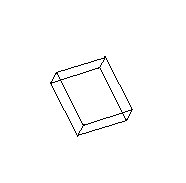

# 旋转立方体

#### 二维旋转矩阵（逆时针为例,  顺时针改为-θ）


$$
R(\theta) = 
\begin{bmatrix}
  cos\theta & -sin\theta \\
  sin\theta & cos\theta
\end{bmatrix}
$$

#### 三维旋转

$$
\begin{bmatrix}
  x' \\
  y' \\
  z' 
\end{bmatrix}= 
\begin{bmatrix}
  1 & 0 & 0 \\
  0 & cos(\theta_x) & sin(\theta_x)\\
  0 & -sin(\theta_x) & cos(\theta_x)
\end{bmatrix}
\begin{bmatrix}
  cos(\theta_y) & 0 & -sin(\theta_y) \\
  0 & 1 & 0\\
  sin(\theta_y) & 0 & cos(\theta_y)\\
\end{bmatrix}
\begin{bmatrix}
  cos(\theta_z) & sin(\theta_z) & 0 \\
  -sin(\theta_z) & cos(\theta_z) & 0\\
  0 & 0 & 1)
\end{bmatrix}
\begin{bmatrix}
  x \\
  y \\
  z 
\end{bmatrix}
$$

坐标原点为立方体中心，立方体初始坐标如下，shape = (8, 3)

```python
[[1, 1, 1], [-1, 1, 1], [1, 1, -1], [-1, 1, -1], [1, -1, -1], [-1, -1, -1], [1, -1, 1], [-1, -1, 1]]
```

坐标需要竖向排列因此先转置为(3, 8)，连续左乘进行旋转即可，再转置回来得到新的坐标，shape = (8, 3)

```python
points = (rotation_x @ rotation_y @ rotation_z @ points.T).T
```

映射为二维平面，三维变二维再加上偏移量移动到画布中心

$$
\begin{bmatrix}
  x \\
  y 
\end{bmatrix}=
\begin{bmatrix}
  -0.5 & 1 & 0 \\
  -0.5 & 0 & 1 
\end{bmatrix}
\begin{bmatrix}
  x \\
  y \\
  z 
\end{bmatrix}+
\begin{bmatrix}
  offset \\
  offset 
\end{bmatrix}
$$


<p align="center">
  
</p>
